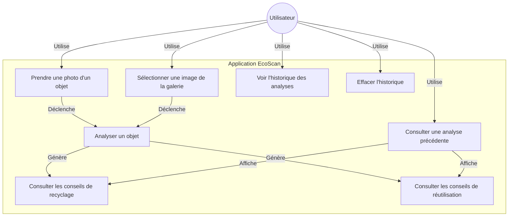
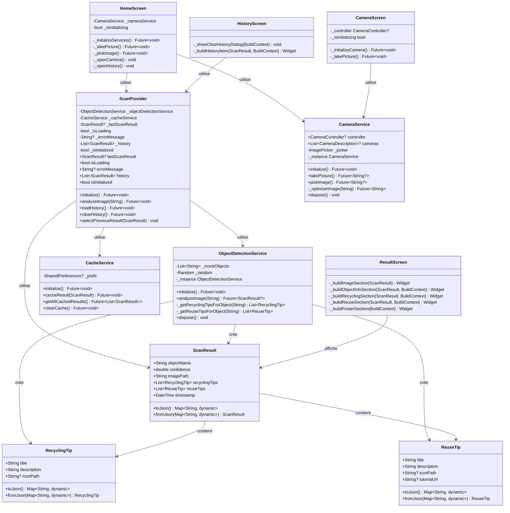
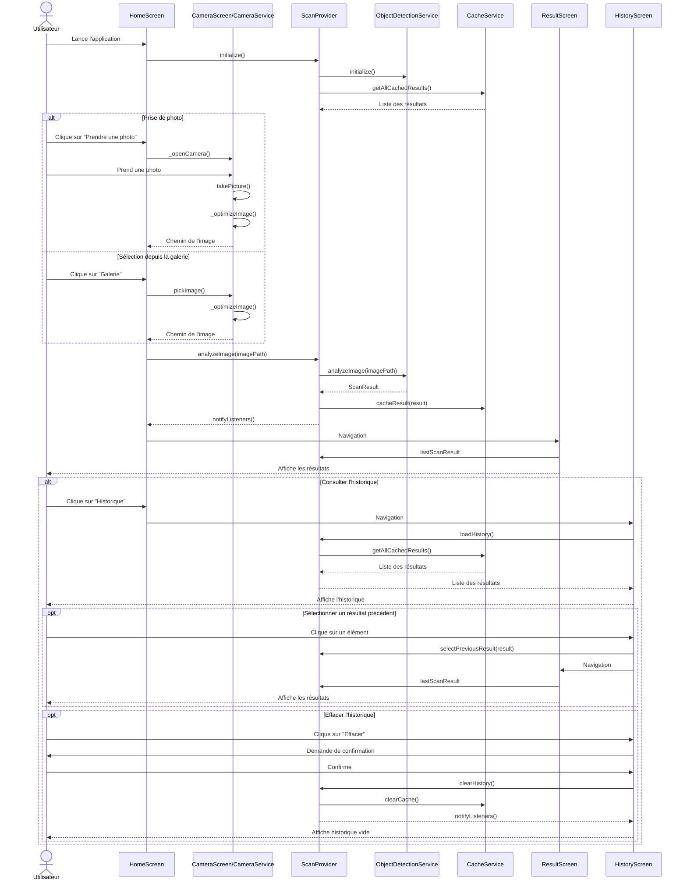

# Diagrammes EcoScan

Ce document présente les diagrammes UML de l'application EcoScan, une application mobile écologique permettant d'identifier des objets et de fournir des conseils de recyclage et de réutilisation.

## Diagramme de cas d'utilisation

## Diagramme de classes

## Diagramme de flux

